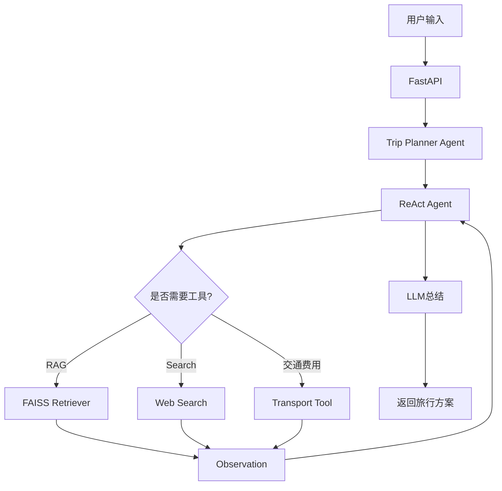

# ✈️ 智旅云图（Smart Travel Agent）

> 基于 **LLM + ReAct Agent + RAG + Tool Calling** 的智能旅行规划系统

<p align="center">

**自然语言旅行助手 · 多轮智能推理 · 攻略检索 · 工具调用 · 个性化路线规划**

</p>

---

# ✨ 项目简介

智旅云图是一套基于 **Agent 架构** 的智能旅行规划系统。

用户可以使用自然语言提出旅行需求，例如：

> 帮我规划三天成都旅行

> 大理适合亲子游吗？

> 去西安需要准备什么？

系统能够自动：

> 理解用户需求 → Agent 推理 → 调用工具 → 检索攻略 → 综合信息 → 生成完整旅行方案

项目采用 **ReAct Agent + RAG + Tool Calling** 的架构，实现了从自然语言理解到旅行规划的完整 Agent Workflow。

---

# 📸 系统展示


---
# 🚀 项目亮点

✅ 基于 **ReAct** 构建自主推理 Agent

✅ 支持 **多轮 Tool Calling**

✅ RAG 本地知识库检索（FAISS）

✅ Web Search 实时搜索补充知识

✅ Embedding + Chunk + Vector Index

✅ FastAPI RESTful API

✅ JWT 用户认证

✅ MySQL 持久化聊天记录

✅ CLI + Web 双入口

---

# 🏗 系统架构



---

# 🧠 Agent Workflow

整个系统采用 ReAct 推理流程：

```
User

↓

Thought

↓

Action

↓

Tool Calling

↓

Observation

↓

Thought

↓

Final Answer
```

例如：

```
用户：

帮我规划成都三日游

↓

Thought

需要先查询成都攻略

↓

Action

RAG Search

↓

Observation

得到成都景点、美食、住宿

↓

Thought

还需要查询天气

↓

Action

Web Search

↓

Observation

天气信息

↓

Final Answer

生成完整旅行规划
```

相比传统 ChatBot：

> Agent 能根据观察结果自主决定是否继续调用工具，而不是一次 Prompt 完成所有任务。

---

# 📚 RAG 知识库

项目内置旅行攻略知识库：

```
data/

├── chengdu_guide.md

├── dali_guide.md

└── xian_guide.md
```

知识入库流程：

```
Markdown

↓

Chunk

↓

Embedding

↓

MySQL

↓

FAISS

↓

Retriever
```

支持：

* Chunk 切分
* Embedding
* Vector Search
* Similarity Retrieval

---

# 🔧 Tool Calling

目前 Agent 可调用多个工具：

| Tool           | 功能        |
| -------------- | --------- |
| RAG Search     | 检索本地攻略知识  |
| Web Search     | 查询实时互联网信息 |
| Transport Cost | 交通费用估算    |
| Image Tool     | 图片内容识别    |
| Trip Planner   | 旅行规划      |

Agent 会根据当前 Observation 决定：

* 是否继续调用工具
* 是否更换关键词重新搜索
* 是否结束推理

真正实现了：

> **Reasoning + Acting**

---

# ⚙️ 技术栈

### AI

* DeepSeek API
* OpenAI Compatible API
* LangChain
* ReAct Agent

### RAG

* Embedding
* FAISS
* Vector Retrieval

### Backend

* FastAPI
* SQLAlchemy
* MySQL

### Authentication

* JWT
* Password Hash

### Others

* Python
* RESTful API

---

# 📂 项目结构

```text
Agent Param/

├── agents/              # Agent 核心
│   ├── react_agent.py
│   ├── rag_tool.py
│   ├── tools.py
│   └── trip_planner_agent.py
│
├── rag/                 # RAG 模块
│   ├── embedding.py
│   ├── retriever.py
│   ├── vector_index.py
│   └── chunker.py
│
├── tools/               # Tool Calling
│   ├── web_search.py
│   └── transport_cost.py
│
├── services/            # 业务逻辑
│
├── database/            # 数据访问
│
├── auth/                # JWT认证
│
├── api/                 # FastAPI接口
│
├── data/                # 攻略知识库
│
├── app.py               # Web入口
└── main.py              # CLI入口
```


---

# 💡 工程难点

## ① Agent 如何自主决定是否继续调用工具？

采用 ReAct 推理框架：

* Thought
* Action
* Observation

Agent 根据 Observation 动态决定下一步，而不是固定调用流程。

---

## ② 如何提升知识回答准确率？

引入 RAG：

* Markdown 文档切分
* Embedding
* FAISS 向量检索
* Top-K Retrieval

减少模型幻觉。

---

## ③ 如何保证回答实时性？

采用：

RAG + Web Search

双检索策略：

```
本地知识优先

↓

信息不足

↓

互联网搜索补充
```

兼顾准确性和实时性。


另外，把 GitHub 仓库名也改成类似 **smart-travel-agent**，比 `Agent Param` 更直观、更有辨识度，面试官一眼就能理解项目定位。
